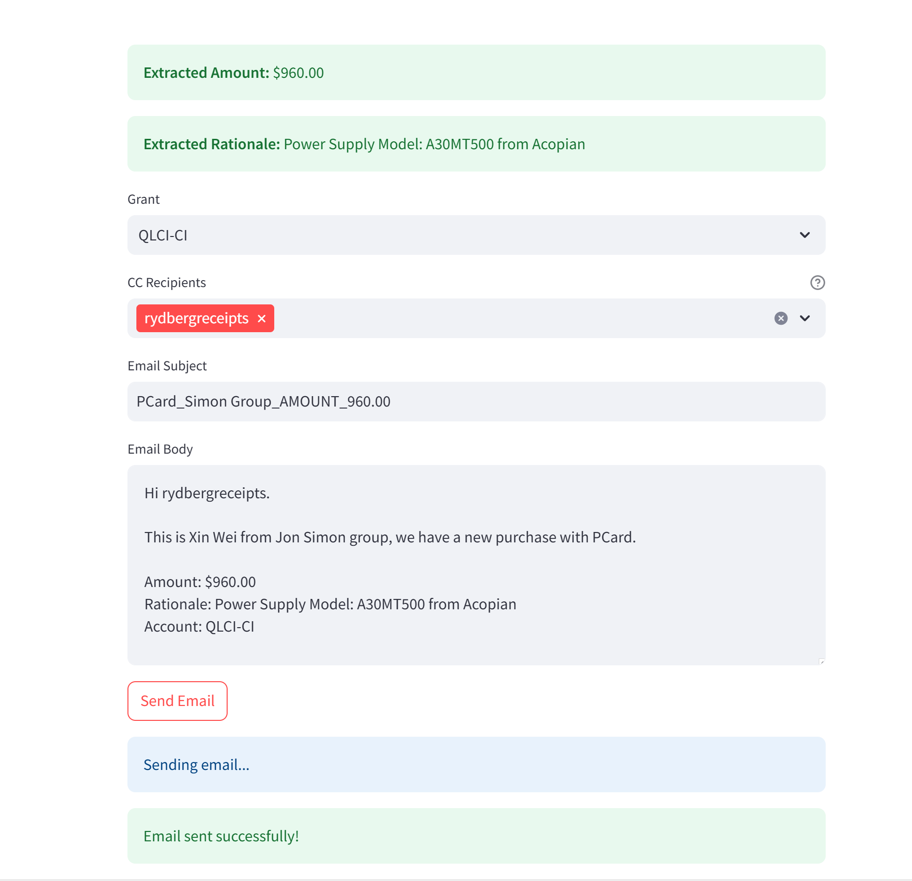

# Lab_Receipt_Bot
A quick tool to help Jon Simon group people to process invoices and receipts, powered by GPT4o-mini.


## Installation
```bash
pip install -r requirements.txt
```

## Running
```bash
streamlit run app_streamlit.py
```

## Usage

`secret.yaml`:
```yaml
openai_api_key: "<openai api key>"
sender_username: "xxx@gmail.com"
sender_password: "<app password>"
```

`config.yaml`:
```yaml
invoice_analysis_prompt: |
  You are given an invoice. You should parse it and do the following:
  1) Identify the final total amount charged in the invoice (the amount paid). Output a float or integer number with no currency symbols or extraneous text.
  2) Describe the main thing of the purchase, with its manufacturer or brand, do not include amounts or quantities.
  Return your result as valid JSON in the form:
  {{
    "amount": "float or int number here",
    "rationale": "short summary or fallback"
  }}


contacts:
  - name: "PhD"
    email: "<phd email>"
    role: "purchaser"
  - name: "Admin"
    email: "<admin email>"
    role: "admin"

grants:
  - name: "<grant display name>"
    code: "<grant code>"

```